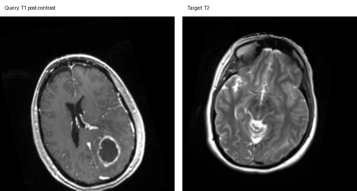
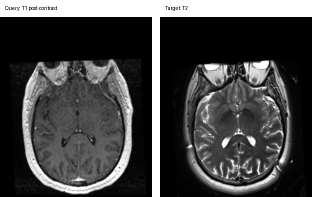

# Соревнование по кросс-модальному ретривалу МРТ головного мозга

Ваша задача — построить систему кросс-модального медицинского ретривала изображений. Для каждого запросного volume МРТ головного мозга нужно ранжировать все кандидатные target-volume МРТ из соответствующей gallery так, чтобы истинный target того же субъекта оказался как можно выше.

## Соревнование на Kaggle

https://www.kaggle.com/t/b33ec3e76c3d4e16a6b56852470b3ebf

## Локальное окружение

Для классического пайплайна ретривала этот репозиторий можно развернуть полностью офлайн
из закэшированных пакетов `uv`, уже хранящихся в репозитории:

```bash
./setup_local_env_offline.sh
source .venv/bin/activate
python -c "import numpy, scipy, sklearn, nibabel; print('env ok')"
```

Этого офлайн-окружения достаточно для:

- `classical_retrieval.py`
- анализа закэшированных векторов
- валидации submission

Его недостаточно для обучения BrainIAC или извлечения эмбеддингов, потому что локальный
кэш сейчас не содержит `torch` и `monai`. Для полноценного окружения с поддержкой BrainIAC
и доступом в интернет установите их онлайн в тот же `.venv`:

```bash
source .venv/bin/activate
pip install torch monai==1.3.2 nibabel numpy scipy scikit-learn
```


## Модальности

- Query: T1 post-contrast MRI
- Target: T2 MRI

Все изображения — это 3D-volume NIfTI `.nii.gz`, приведённые к ориентации RAS.

## Структура данных

Данные разбиты на три независимых датасета:

```text
dataset1/
  train_pairs.csv
  val_queries.csv
  val_gallery.csv
  test_queries.csv
  test_gallery.csv
  images/
    train/
    val/
    test/

dataset2/
  val_queries.csv
  val_gallery.csv
  test_queries.csv
  test_gallery.csv
  images/
    val/
    test/

dataset3/
  val_queries.csv
  val_gallery.csv
  test_queries.csv
  test_gallery.csv
  images/
    val/
    test/

sample_submission.csv
```

`dataset1` содержит размеченные обучающие пары. У `dataset2` и `dataset3` нет размеченных обучающих пар — они предназначены для оценки обобщающей способности.

## Описание датасетов

### Dataset 1

`dataset1` содержит только предоперационные пары МРТ. Это размеченный обучающий набор для соревнования: каждая строка в `dataset1/train_pairs.csv` задаёт соответствующую друг другу запросную T1 post-contrast и target-изображение T2 одного и того же субъекта.

Все пары `dataset1`, включая обучающие, валидационные и тестовые, зарегистрированы на общей координатной сетке изображения. Вы можете использовать этот факт при обучении на размеченных парах и при разработке методов на этом датасете.

Валидационные и тестовые данные `dataset1` предоставляются в виде query/gallery-пулов ретривала. Правильные соответствия скрыты и используются для подсчёта очков на лидерборде.

### Dataset 2

`dataset2` содержит предоперационные пары МРТ из того же источника, что и `dataset1`, но к валидационным и тестовым изображениям применены случайный жёсткий поворот/сдвиг и нелинейные деформации. Запросное и target-изображение в правильной паре деформированы независимо, поэтому они больше не разделяют единую геометрию.

Размеченных обучающих пар для `dataset2` не предоставляется. Он предназначен для проверки того, способен ли метод обобщиться с зарегистрированных данных разработки на условия синтетической геометрической вариативности.

Пример ниже показывает одну правильную пару query-target из `dataset2` на одном репрезентативном срезе из каждого volume:



### Dataset 3

`dataset3` содержит пары МРТ предоперационное-к-интраоперационному. Размеченных обучающих пар для `dataset3` не предоставляется; он предназначен для оценки обобщения на структурно более отличающиеся условия.

В `dataset3` каждое интраоперационное target-изображение пересэмплировано в то же геометрическое пространство, что и соответствующее ему предоперационное запросное изображение, с использованием физических координат исходного изображения. Это не означает, что изображения зарегистрированы в строгом смысле. Кандидаты — это интраоперационные изображения, поэтому анатомия может структурно отличаться от предоперационного запроса: ткани могли сместиться, части мозга могут отсутствовать, а локальные структуры могут выглядеть иначе из-за вмешательства. Цель по-прежнему состоит в том, чтобы найти соответствующего субъекта, но точное локальное выравнивание не гарантируется.

Пример ниже показывает одну правильную пару query-target из `dataset3` на одном репрезентативном срезе из каждого volume:



### Замечания по препроцессингу

Все изображения приведены к NIfTI, ориентации RAS и шагу вокселей 1.0 x 1.0 x 1.0 мм. В рамках этого релиза не применялись нормализация интенсивностей, сопоставление гистограмм, удаление черепа (skull stripping), деформируемая регистрация или обрезка (cropping).

Ваш код не должен предполагать одну фиксированную форму изображения для всего соревнования. Соответствующие друг другу запросные и target-volume также могут отличаться по форме, особенно в `dataset2` и `dataset3`.

## Файлы

### Обучение

`dataset1/train_pairs.csv` содержит размеченные пары query-target:

```text
pair_id,query_id,target_id,query_image,target_image,query_modality,target_modality,dataset
```

### Манифесты запросов (Query Manifests)

Валидационные и тестовые query-файлы содержат:

```text
query_id,query_image,query_modality,dataset
```

### Манифесты gallery (Gallery Manifests)

Валидационные и тестовые gallery-файлы содержат:

```text
target_id,target_image,target_modality,dataset
```

## Пулы ретривала

Три датасета — это независимые пулы ретривала. Всегда ранжируйте запрос только относительно gallery из того же датасета и того же split:

- `dataset1/val_queries.csv` использует `dataset1/val_gallery.csv`
- `dataset1/test_queries.csv` использует `dataset1/test_gallery.csv`
- `dataset2/val_queries.csv` использует `dataset2/val_gallery.csv`
- `dataset2/test_queries.csv` использует `dataset2/test_gallery.csv`
- `dataset3/val_queries.csv` использует `dataset3/val_gallery.csv`
- `dataset3/test_queries.csv` использует `dataset3/test_gallery.csv`

Не ранжируйте запросы одного датасета относительно gallery другого датасета и не смешивайте валидационные и тестовые gallery.

## Размеры

```text
dataset1:
  train pairs: 350
  validation queries/gallery: 40 / 40
  test queries/gallery: 100 / 100

dataset2:
  validation queries/gallery: 40 / 40
  test queries/gallery: 100 / 100

dataset3:
  validation queries/gallery: 20 / 20
  test queries/gallery: 77 / 77
```

## Оценка

Очки — это mean reciprocal rank (MRR), вычисляемый отдельно для `dataset1`, `dataset2` и `dataset3`, а затем усредняемый:

```text
score = (dataset1_MRR + dataset2_MRR + dataset3_MRR) / 3
```

Для каждого запроса reciprocal rank равен `1 / rank` истинного соответствующего target в отправленном ранжировании. Если истинный target отсутствует или строка запроса опущена в submission, этот запрос получает reciprocal rank `0`.

Kaggle использует скрытый файл решения, чтобы определить, какие строки публичные, а какие приватные:

- строки валидационных запросов оцениваются на публичном лидерборде во время соревнования
- строки тестовых запросов оцениваются на приватном лидерборде для финального ранжирования

Участники не включают столбец split. Kaggle сопоставляет строки по `query_id`, а затем внутренне оценивает публичное и приватное подмножества.

## Формат submission

**Внимание: на Kaggle действует ограничение в 100 submission на команду в день!**

Kaggle ожидает один файл submission на попытку. Отправляйте один объединённый CSV с теми же столбцами, что и в корневом `sample_submission.csv`; не отправляйте отдельные файлы для отдельных датасетов.

```text
query_id,target_id_ranking
q_...,g_... g_... g_... ...
```

Все значения `query_id` и `target_id` глобально уникальны для всех трёх датасетов, поэтому объединённый файл может включать строки из `dataset1`, `dataset2` и `dataset3` без дополнительного столбца датасета.

Каждая отправленная строка должна содержать полное ранжирование всех target ID из соответствующей запросу gallery того же датасета и того же split. Ранжирования разделяются пробелами и упорядочены от наиболее вероятного соответствия к наименее вероятному.

Например, запрос из `dataset2/test_queries.csv` должен ранжировать все target ID из `dataset2/test_gallery.csv` и ни одного target ID из какой-либо валидационной gallery или из другого датасета:

```text
query_id,target_id_ranking
q_example_dataset2_test,g_first_choice g_second_choice g_third_choice ...
```

Ожидаемые длины ранжирований:

```text
dataset1 validation rows: 40 target IDs
dataset1 test rows: 100 target IDs
dataset2 validation rows: 40 target IDs
dataset2 test rows: 100 target IDs
dataset3 validation rows: 20 target IDs
dataset3 test rows: 77 target IDs
```

Полный шаблон submission содержит по одной строке на каждый валидационный и тестовый запрос из всех трёх датасетов — всего `377` строк. Частичные submission разрешены:

- Для экспериментов только на валидации отправляйте строки из файлов `val_queries.csv`.
- Для полных submission соревнования отправляйте строки и валидационных, и тестовых запросов в одном файле.
- Чтобы сначала сосредоточиться на одном датасете, отправляйте только строки этого датасета и опускайте остальные. Опущенные датасеты получают ноль очков. Умножение отображаемого счёта на `3` даёт MRR для отправленного датасета.

## Код baseline

Мы предоставляем небольшой baseline на MONAI + PyTorch, чтобы помочь вам начать работу с форматом данных соревнования, препроцессингом, циклом обучения и генерацией submission.

Baseline намеренно прост. Он не задуман как сильное решение. Его цель — продемонстрировать:

* как загружать 3D-volume NIfTI с помощью MONAI
* как применять базовый препроцессинг медицинских изображений и создавать быстрозагружаемый кэш
* как записать валидный файл submission для Kaggle
* сложность задачи на разных датасетах

Установите и запустите его с помощью uv:

```sh
DATA_ROOT=/path/to/kaggle_dataset
uv run slice_clip_baseline.py \
  --data-root "$DATA_ROOT" \
  --train-pair-csv "$DATA_ROOT/dataset1/train_pairs.csv" \
  --query-csv "$DATA_ROOT/dataset1/val_queries.csv" \
  --gallery-csv "$DATA_ROOT/dataset1/val_gallery.csv" \
  --query-csv "$DATA_ROOT/dataset1/test_queries.csv" \
  --gallery-csv "$DATA_ROOT/dataset1/test_gallery.csv" \
  --query-csv "$DATA_ROOT/dataset2/val_queries.csv" \
  --gallery-csv "$DATA_ROOT/dataset2/val_gallery.csv" \
  --query-csv "$DATA_ROOT/dataset2/test_queries.csv" \
  --gallery-csv "$DATA_ROOT/dataset2/test_gallery.csv" \
  --query-csv "$DATA_ROOT/dataset3/val_queries.csv" \
  --gallery-csv "$DATA_ROOT/dataset3/val_gallery.csv" \
  --query-csv "$DATA_ROOT/dataset3/test_queries.csv" \
  --gallery-csv "$DATA_ROOT/dataset3/test_gallery.csv" \
  --out slice_clip_submission.csv
```

Это записывает объединённый файл submission:

`slice_clip_submission.csv`

Файл можно отправить напрямую на Kaggle.

## Классические косинусные эмбеддинги

Для более сильного нейросетевого baseline `classical_retrieval.py` может:

* извлекать hand-crafted 3D-признаки МРТ в закэшированные векторы
* строить финальные query/gallery-эмбеддинги
* ранжировать gallery-target по косинусной близости
* записывать готовый к отправке CSV для Kaggle

Запуск из корня репозитория:

```sh
uv run classical_retrieval.py embed-submit \
  --data-root ehl-paris-medical-image-retrieval \
  --vectors-dir artifacts/vectors/fusion_default_plus_pca \
  --out submissions/cosine_vectors_fusion_default_plus_pca.csv
```

Это записывает один файл `.npz` с `query_ids`, `target_ids`, `query_vectors` и
`target_vectors` для каждого пула датасет/split, плюс объединённый CSV submission.

## Косинусные эмбеддинги BrainIAC

Чтобы сгенерировать эмбеддинги фундаментальной модели с предобученным backbone BrainIAC
и ранжировать gallery-target по косинусной близости:

```sh
uv run brainiac_cosine_retrieval.py \
  --data-root ehl-paris-medical-image-retrieval \
  --checkpoint /path/to/BrainIAC.ckpt \
  --vectors-dir artifacts/vectors/brainiac_cosine \
  --out submissions/brainiac_cosine_submission.csv
```

Это записывает один файл `.npz` на каждый пул датасет/split с `query_vectors` и
`target_vectors`, плюс объединённый CSV submission для Kaggle.

Вы также можете отправить только один датасет, чтобы получить интуицию о сложности каждого пула ретривала.
Например, чтобы обучиться на dataset1 и отправить только валидационные и тестовые строки dataset1:

```sh
DATA_ROOT=/path/to/kaggle_dataset
uv run slice_cnn_baseline.py \
  --data-root "$DATA_ROOT" \
  --train-pair-csv "$DATA_ROOT/dataset1/train_pairs.csv" \
  --query-csv "$DATA_ROOT/dataset1/val_queries.csv" \
  --gallery-csv "$DATA_ROOT/dataset1/val_gallery.csv" \
  --query-csv "$DATA_ROOT/dataset1/test_queries.csv" \
  --gallery-csv "$DATA_ROOT/dataset1/test_gallery.csv" \
  --out dataset1_submission.csv
```
